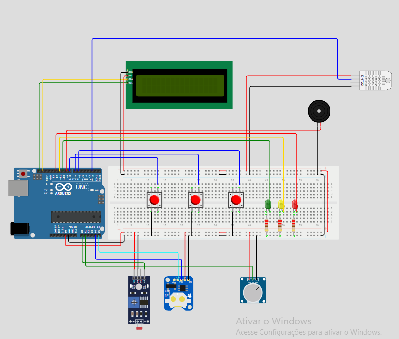

# 🍷Vinho no Display

## 👥 Integrantes do grupo

* CAUÃ VECHINI LIMA – RA: 082250039
* JULIANA MEDEIROS SILVA – RA: 082240040
* LÍVIA PEREIRA QUEIROZ – RA: 082240013
* LUCAS PIOVEZAN DOS SANTOS - RA: 082250040
* RAFAEL AKIO BUOSO WATANABLE – RA: 082240007

## 📌 Sobre o projeto

O **Vinho no Display** é um projeto desenvolvido para monitorar as condições do ambiente onde os vinhos são armazenados.

O sistema realiza a medição da **temperatura** e da **umidade do ambiente**, permitindo acompanhar essas informações e verificar se as condições de armazenamento estão adequadas.

## 💻 Código do projeto

O código utilizado no projeto está disponível no arquivo:

`vinho-no-display`

Para utilizar o código, basta:

1. Abrir a **Arduino IDE**.
2. Abrir o arquivo `vinho-no-display`.
3. Copiar o código.
4. Colar o código na Arduino IDE.
5. Selecionar a placa Arduino utilizada.
6. Selecionar a porta correta.
7. Fazer o upload do código para a placa.

Após o upload, o sistema estará pronto para realizar as medições de **temperatura e umidade**.

## 🛠️ Tecnologias utilizadas

* Arduino
* Sensor de temperatura e umidade
* Arduino IDE
* C/C++

## 🎯 Objetivo

Desenvolver uma solução simples para monitorar as condições ambientais de armazenamento de vinhos, utilizando sensores e um microcontrolador para realizar a coleta das informações.

📷 Imagem do projeto

  

